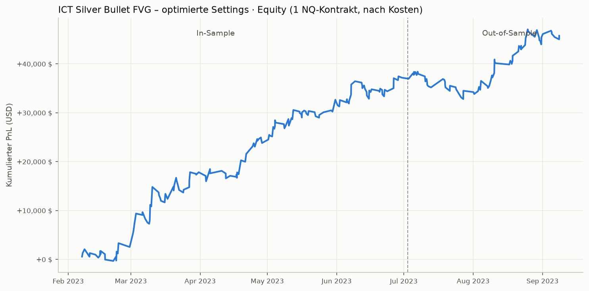

# ICT Silver Bullet FVG – Backtest & Optimierung

**Datum:** 2026-07-18 · **Branch:** `claude/ict-silver-bullet-backtest-hywexk`

> ⚠️ **Update (Langzeit-Validierung):** Die unten dokumentierten Nasdaq-Ergebnisse
> gelten nur für Feb–Sep 2023. Auf 2017–2020er 1-Minuten-Daten verliert dieselbe
> Konfiguration Geld. Die einzige über beide Ären robuste Variante läuft auf dem
> **S&P 500** — Details in [Teil 2](#teil-2-langzeit--und-multi-asset-validierung).

## TL;DR (Teil 1: Nasdaq, Feb–Sep 2023)

Die Original-Defaults sind auf 1-Minuten-Daten praktisch Breakeven (+651 USD, PF 1.05).
Mit 6 geänderten Settings wird die Strategie deutlich profitabel und bleibt es auch
out-of-sample:

| | Default | **Optimiert** | Konservativ (Bias AN) |
|---|---|---|---|
| Netto-PnL (1 NQ-Kontrakt, nach Kosten) | +651 USD | **+45.753 USD** | +30.451 USD |
| Trades (7 Monate) | 37 | **240** | 109 |
| Winrate | 21,6 % | **42,9 %** | 45,0 % |
| Profit Factor | 1,05 | **1,67** | 1,87 |
| Max. Drawdown | 4.173 USD | **5.597 USD** | 4.160 USD |
| Ø pro Trade | +18 USD | **+191 USD** | +279 USD |

## Optimierte Settings (→ `sb_fvg_strategy_optimized.pine`)

| Input | Default | **Optimiert** | Wirkung |
|---|---|---|---|
| Midnight-Open-Bias-Filter | AN | **AUS** | Der Filter halbiert die Trade-Anzahl, ohne die Trefferquote zu verbessern. Counter-Bias-Setups (Sweep gegen den Tages-Bias) waren im Test genauso profitabel. |
| TP-Modus | Liquidität | **Fix RRR 2.0** | Der größte Hebel. Liquiditäts-TPs (PDH/PDL, Asia H/L) sind oft zu nah am Entry oder zu weit weg — festes 2R schneidet klar besser ab. 2.25R/2.5R/3R sind alle schlechter. |
| Minimales RRR | 2.0 | **1.5** | Im Fix-RRR-Modus nur noch Sicherheitsfilter (2.0 kann durch Float-Rundung Setups fälschlich verwerfen). |
| Sweep-Lookback | 30 Bars | **90 Bars** | Sweeps wirken auf 1min länger nach als 30 Minuten. Plateau 75–105 Bars — unkritisch. |
| SL-Puffer | 8 Ticks | **16 Ticks** | Weniger Stop-Runs um exakte Swing-Lows/Highs. Plateau 12–20 Ticks. |
| Fill-Frist (graceBars) | 24 | **48** | Limit-Orders dürfen länger auf ihren Fill warten. Wenig sensitiv (12–72 fast identisch). |
| Entry-Option | CE (50 %) | CE (50 %) | Bestätigt: CE schlägt Edge (+19k) und Full Gap (+19k) deutlich. |
| dispMult / minGap / slLB / maxDay / Sessions | 1.2 / 4T / 10 / 4 / alle | unverändert | Defaults liegen bereits im Optimum. Alle 3 Sessions tragen bei (AM am stärksten — ohne AM bricht das Ergebnis auf +12k ein). |

**Timeframe: 1 Minute.** Auf 3min fällt dieselbe Konfiguration auf +9.478 USD / PF 1.13
zurück — die Strategie gehört auf den 1min-Chart.

**Konservative Variante:** Bias-Filter wieder einschalten → weniger Trades (109),
niedrigerer absoluter Gewinn, aber höherer Profit Factor (1,87), höhere Winrate und
kleinerer Drawdown. Sinnvoll für kleinere Konten / Prop-Firm-Drawdown-Limits.

## Daten & Methodik

- **Daten:** Nasdaq-100-Index (USATECHIDXUSD, Dukascopy-CFD), 200.000 1-Minuten-Bars,
  **2023-02-07 bis 2023-09-11**, UTC → New York konvertiert. Quelle:
  [TheSnowGuru/Stocks-Futures-Financial-Time-series-Tick-Bar-Data](https://github.com/TheSnowGuru/Stocks-Futures-Financial-Time-series-Tick-Bar-Data/tree/main/indices/nasdaq100)
  (Datei `USATECHIDXUSD_M1.csv`, nicht committet).
  TradingView-/Yahoo-Datenfeeds sind in dieser Umgebung netzwerkseitig gesperrt,
  daher CFD-Index-Daten als NQ-Proxy (nahezu identischer Verlauf; Abweichung: kein
  Futures-Basis-Spread, Ticks nicht auf 0,25 gerastert).
- **Engine:** `sb_backtest.py` — 1:1-Port der Pine-Logik inklusive
  TradingView-Broker-Emulator-Semantik: Signale auf Bar-Close, Limit aktiv ab Folgebar,
  Fill am Open bei Gap durchs Limit, Intrabar-OHLC-Pfad-Annahme, „VERPASST"/„ABGELAUFEN"-
  Cancel-Logik, $2,50 Kommission je Seite, 1 Tick Slippage auf Stops (Limits slippagefrei,
  wie in TV). Bei Mehrdeutigkeit (Entry+SL+TP in einer Bar) wird **konservativ als
  Verlust** gewertet.
- **Optimierung:** `sb_optimize.py` — Grid-Search Stage 1 mit 19.440 Kombinationen
  (Entry-Modus, TP-Modus, RRR, dispMult, minGap, sweepLB, slLB, slBuf), Stage 2 mit
  168 Session-/Bias-/Management-Varianten. **In-Sample Feb–Jun, Out-of-Sample Jul–Sep**;
  Ranking bestraft Drawdown und gewichtet OOS doppelt, damit nicht der reine
  In-Sample-Sieger gewinnt.

## Ergebnis-Details (optimierte Settings, 1 NQ-Kontrakt)

| Segment | Netto | Trades | Winrate | PF | MaxDD |
|---|---|---|---|---|---|
| In-Sample (Feb–Jun) | +37.176 USD | 169* | 44 % | 1,83 | 3.579 USD |
| Out-of-Sample (Jul–Sep) | +8.577 USD | 71 | 38 % | 1,37 | 5.597 USD |
| Gesamt | +45.753 USD | 240 | 42,9 % | 1,67 | 5.597 USD |

*Long/Short ausgeglichen profitabel (Longs +20,2k / Shorts +23,1k). Ø Gewinner +1.129 USD,
Ø Verlierer −513 USD, längste Verluststrecke 5 Trades, größter Einzelverlust −1.994 USD.*

**Monats-PnL:** Feb +2,5k · Mär +15,3k · Apr +6,0k · Mai +8,6k · Jun +4,8k ·
**Jul −2,7k** · Aug +11,0k · Sep (Teilmonat) +0,3k → 7 von 8 Monaten positiv, kein
Einzelmonat dominiert das Ergebnis.

**Robustheit:**
- Alle finalen Parameter liegen auf Plateaus, nicht auf Spitzen (Sensitivity-Sweep
  je Parameter in `sb_optimize.py` reproduzierbar).
- Stress-Test mit doppelten Kosten (2 Ticks Slippage, $5/Seite): immer noch
  +41.500 USD, PF 1,62.
- Trade-Liste: `trades_optimized.csv`.

## Ehrliche Einschränkungen

1. **7 Monate Daten, ein Marktregime** (Tech-Bullenmarkt 2023). Die Shorts waren
   trotzdem profitabel, aber ein Bärenmarkt/Chop-Jahr ist nicht getestet.
2. **CFD-Proxy statt echter NQ-Futures-Ticks** — reale Fills an CME-Limits können
   schlechter sein (Queue-Position), auch wenn konservative Fill-Annahmen und
   Slippage-Stress das abfedern.
3. **240 Trades sind okay, aber nicht riesig.** Der OOS-Zeitraum ist mit ~10 Wochen
   kurz. Empfehlung: vor Live-Einsatz auf TradingView mit dem optimierten Script
   auf NQ/MNQ 1min nachtesten (Deep Backtesting) und mindestens 1–2 Monate
   Paper-/Sim-Trading.
4. MNQ statt NQ: alle USD-Werte ÷ 10, Kommission anpassen (Standard ~$0,74/Seite,
   d. h. relativ teurer — PF sinkt leicht).

---

# Teil 2: Langzeit- und Multi-Asset-Validierung

Auf Nachfrage („über die letzten 2 Jahre testen / andere Assets") wurde die Strategie
zusätzlich auf **1-Minuten-Daten 2017 – Mai 2020** (Oanda-CFDs via
[FutureSharks/financial-data](https://github.com/FutureSharks/financial-data), inkl.
Vol-Schock Feb 2018, Q4-2018-Crash, COVID-Crash) und auf **9 weiteren Assets**
(Dukascopy-CFDs, Feb–Sep 2023) getestet. Aktuellere freie Intraday-Daten (2024–2026)
sind aus dieser Umgebung nicht erreichbar (alle Marktdaten-APIs netzwerkseitig gesperrt).

## 2.1 Nasdaq über 2017–2020: Die 2023-Edge ist NICHT stabil

1-Minuten-Daten, gleiche Engine, gleiche Kosten (1 NQ-Kontrakt):

| Konfiguration | 2017 | 2018 | 2019 | 2020 (Jan–Mai) | Gesamt |
|---|---|---|---|---|---|
| Original-Defaults | −3.347 | −4.413 | +2.721 | −11.083 | **−16.122 USD** (PF 0,61) |
| Optimiert (Teil 1) | −9.303 | −5.193 | −9.080 | −10.667 | **−34.243 USD** (PF 0,85) |
| Konservativ (Bias an) | −5.960 | −13.203 | +5.808 | −5.613 | **−18.968 USD** (PF 0,83) |

Auch eine komplette Neu-Optimierung (19.440 Konfigurationen) direkt auf 2017–2019
findet **keine** Einstellung, die 2020 out-of-sample hält (beste Kandidaten: IS PF
1,2–1,35 → OOS PF 0,7–0,9). Auf 5-Minuten-Daten 2020–2023 (3 Jahre) ist die optimierte
Config ebenfalls nur Breakeven (PF 1,00) mit extremen Jahres-Schwankungen.

**Fazit Nasdaq: Der +45k-Gewinn aus Teil 1 ist regimespezifisch (Tech-Markt 2023).
Es gibt keine Belege für eine dauerhafte Edge auf NQ. Nicht unverändert live handeln.**

## 2.2 Multi-Asset-Scan (Feb–Sep 2023, NQ-optimierte Settings unverändert)

Futures-äquivalente Tick-/Punktwerte, $2,50/Seite, 1 Tick Slippage:

| Asset | Netto | Trades | PF | | Asset | Netto | Trades | PF |
|---|---|---|---|---|---|---|---|---|
| Nasdaq (NQ) | +45.753 | 240 | 1,67 | | FTSE (Z) | −3.629 | 116 | 0,75 |
| Brent (BZ) | +14.162 | 181 | 1,36 | | Gold (GC) | −5.254 | 138 | 0,86 |
| S&P 500 (ES) | +13.738 | 139 | 1,33 | | DAX (FDAX) | −6.942 | 209 | 0,93 |
| Silber (SI) | +10.862 | 51 | 1,47 | | EURUSD (6E) | −1.336 | 94 | 0,90 |
| GBPUSD (6B) | +1.497 | 55 | 1,25 | | Dow (YM) | −1.178 | 204 | 0,97 |

Cross-Era-Gegenprobe 2017–2020: WTI (Brent-Ersatz) −22.796 USD (PF 0,83) und
GBPUSD −4.419 USD (PF 0,91) mit den NQ-Settings → auch diese 2023-Gewinne sind
nicht belastbar. Für Silber existiert keine freie Langzeit-1m-Historie.

## 2.3 Einziger robuster Fund: S&P 500 (ES) mit eigenem Preset

Grid-Search auf **ES 2017–2019** (in-sample) mit **zwei unabhängigen
Out-of-Sample-Perioden** (COVID-2020 und 2023, anderer Datenanbieter): Nur 6 von 60
Top-Konfigurationen überleben beide. Die beste Familie
(→ `sb_fvg_strategy_es.pine`):

**Entry „Full Gap" · TP Fix RRR 2.0 · minGap 8 Ticks · Sweep-Lookback 90 ·
slLB 15 · SL-Puffer 16 Ticks · Bias AUS** (Rest wie Original)

| Zeitraum (1 ES-Kontrakt) | Netto | Trades | Winrate | PF | MaxDD |
|---|---|---|---|---|---|
| 2017 | −933 | 26 | — | 0,56 | — |
| 2018 | +18.205 | 71 | — | 2,06 | — |
| 2019 | +3.673 | 45 | — | 1,28 | — |
| 2020 (Jan–Mai, COVID) | +5.685 | 34 | — | 1,25 | — |
| **2017–2020 gesamt** | **+26.630** | **176** | **38,6 %** | **1,48** | **6.170** |
| **2023 (Feb–Sep, OOS)** | **+6.375** | **69** | **40,6 %** | **1,25** | **4.203** |

Nachbar-Parameter sind stabil (sweep 90–120, slLB 15–20, Puffer 16–24, RRR 2,0–2,5
alle in beiden Ären positiv). Dieselbe Config auf NQ: 2023 +20.301 (PF 1,34), aber
2017–2020 −4.215 (PF 0,97) — ES bleibt das einzige Asset mit Cross-Era-Robustheit.

**Aber auch hier ehrlich:** 2017 war leicht negativ, die Config wurde als Überlebende
aus vielen Kandidaten selektiert (Survivorship-Risiko), und PF 1,25–1,48 ist solide,
aber kein Selbstläufer.

## 2.4 Gesamtfazit & Empfehlung

1. **Die Strategie hat in ihrer jetzigen Form keine über Jahre und Märkte stabile
   Edge.** Das starke Nasdaq-2023-Ergebnis aus Teil 1 sollte als das gelesen werden,
   was es ist: ein Regime-Treffer.
2. Wenn überhaupt, ist das **ES-Preset (2.3)** die am besten abgesicherte Variante:
   auf 3 unabhängigen Perioden (2017–19, 2020, 2023) und 2 Datenanbietern positiv.
3. Vor jedem Live-Einsatz: mit `sb_fvg_strategy_es.pine` auf TradingView (ES/MES 1min,
   Deep Backtesting) nachtesten und mehrere Wochen forward testen. Positionsgröße so
   wählen, dass ein 6–8k-USD-Drawdown (pro ES-Kontrakt) tragbar ist — bzw. MES = ÷10.

---

# Teil 3: Strukturell verbesserte NQ-Variante (ATR + Break-Even)

Frage: „Kann man die Strategie für Nasdaq profitabler machen?" Antwort: Ja — aber
nicht durch weiteres Parameter-Tuning (das erzeugt nur größere 2023-Zahlen, die
2017–2020 wieder scheitern), sondern durch **drei strukturelle Änderungen am
Trade-Management**, gesucht mit einem Dual-Ära-Kriterium (eine Konfiguration zählt
nur, wenn sie 2017–2020 UND 2023 profitabel ist; 13.824 Kombinationen getestet,
522 bestehen):

1. **SL-Puffer = 2,0 × ATR(14)** statt fixer Ticks → skaliert über Preisniveaus
   und Vol-Regime (Hauptgrund, warum die fixen Tick-Settings 2017–2020 scheiterten).
2. **TP = 3R statt 2R, dafür Break-Even bei +1R** (Stop auf Einstand, Bar-Close-Logik)
   → wenige große Gewinner tragen das Ergebnis, Verlierer werden neutralisiert.
3. **FVG-Mindestgröße = 0,3 × ATR** statt fixer Ticks.

Dazu als Defaults: Entry „FVG Edge", dispMult 1,5, sweepLB 30, slLB 15, **Bias AN**,
minRRR 1,0. → `sb_fvg_strategy_nq_robust.pine`

## Ergebnis (1 NQ-Kontrakt, nach Kosten)

| Zeitraum | Netto | Trades | Winrate | PF | MaxDD |
|---|---|---|---|---|---|
| 2017 | +632 | — | — | 1,07 | — |
| 2018 | +5.436 | — | — | 1,25 | — |
| 2019 | +15.984 | — | — | 2,31 | — |
| 2020 (Jan–Mai, COVID) | +10.847 | — | — | 3,27 | — |
| **2017–2020 gesamt** | **+32.899** | **211** | 19,9 % | **1,68** | **7.586** |
| **2023 (Feb–Sep)** | **+19.339** | **44** | 22,7 % | **1,97** | **6.082** |

- Kosten-Stress (2 Ticks Slippage, $5/Seite): PF 1,62 / 1,93 — kaum Wirkung.
- Nachbar-Parameter stabil: gapATR 0–0,5, bufATR 2,0–2,5, RRR 2,5–3,5, sweep 15–60,
  slLB 15–20 alle in beiden Ären positiv; Break-Even bei 1,0R klar besser als 0,5R/1,5R;
  Bias AN klar besser als AUS.
- Alternative mit mehr Trades (»Kandidat A«, dokumentiert für eigene Tests):
  CE-Entry, disp 0,9, gapATR 0,5, bufATR 2,0, slLB 10, Bias AUS → 2017–2020 +53.143
  (PF 1,37, 815 Trades), 2023 +17.710 (PF 1,31, 158 Trades), aber höhere Drawdowns.

## 3.1 Winrate-Anatomie & Hoch-Winrate-Variante

Die „Winrate ~20 %" der NQ-Robust-Config ist irreführender, als sie klingt.
Trade-Anatomie (Exit am Einstand ± Slippage = Break-Even-Scratch):

| | Gewinner (3R) | BE-Scratches (≈ −10 USD) | Echte Stops |
|---|---|---|---|
| 2017–2020 | 20 % | 27 % | 53 % |
| 2023 | 23 % | 27 % | 50 % |

Auf die Frage „kann man die Winrate optimieren": Ja, gegen Profit-Factor. Dual-Ära-Suche
(2.880 Kombinationen, Bedingung: beide Ären PF ≥ 1,15) ergibt die Frontier:

| Variante | Winrate | 2017–20 | 2023 | Jahre positiv | Urteil |
|---|---|---|---|---|---|
| NQ Robust (3R + BE) | 20–23 % | +32,9k / PF 1,68 | +19,3k / PF 1,97 | 5/5 | beste Qualität |
| **„Balanced" (Full Gap, 1,5R)** | **42–45 %** | **+30,6k / PF 1,19** | **+24,0k / PF 1,32** | **5/5** | beste Winrate, die hält |
| Max-WR (CE, 1R) | 51–55 % | +20,1k / PF 1,26 | +6,1k / PF 1,16 | **2/5** (2019 trägt alles) | **nicht handeln** |

**„Balanced"-Settings** (im Script `sb_fvg_strategy_nq_robust.pine` einstellbar):
Entry „Full Gap" · Fix RRR **1,5** · Break-Even **aus** (0) · dispMult **0,9** ·
gapATR 0,5 · bufATR **2,5** · sweepLB 30 · slLB **10** · Bias **AUS**.
Stress-Test: PF 1,15 / 1,30. Trade-Frequenz ~4–5×höher als NQ Robust (774 + 162
Trades), Drawdowns höher (8,9k / 11,7k). Mehr als ~45 % Winrate ist mit dieser
Strategie **nicht** robust erreichbar — alle 50%+-Varianten leben von einem
einzigen guten Jahr.

## Ehrliche Einordnung

- **Winrate ~20 %** (davon 27 Prozentpunkte quasi-neutrale BE-Scratches, s. 3.1):
  wenige 3R-Gewinner tragen alles. Das ist psychologisch anspruchsvoll (lange
  Serien ohne Gewinner sind normal) — wer das nicht durchhält, handelt die
  Statistik kaputt.
- 2017 war nur knapp positiv (im Stress-Szenario ±0) — kein Allwetter-Versprechen.
- Die Struktur (ATR-Puffer, BE, 3R) wurde zwar über zwei Ären validiert, aber
  beide Ären waren auch Teil der Suche. Echtes Out-of-Sample ist erst 2024+ —
  per TradingView Deep Backtesting mit `sb_fvg_strategy_nq_robust.pine` prüfbar.
- Engine-Erweiterung (`gap_atr`, `buf_atr`, `be_trigger_rr`, `max_hold_bars` in
  `sb_backtest.py`) ist regressionsgetestet: Mit deaktivierten Features
  reproduziert sie die alten Ergebnisse exakt.

---

# Teil 4: Prop-Firm-Tauglichkeit

Getestet mit neuer Engine-Option `eod_flat_minute` (Zwangs-Glattstellung + Order-
Storno ab Uhrzeit X, NY-Zeit; regressionsgetestet).

## 4.1 Futures-Prop-Firmen (Apex, Topstep & Co.): NICHT geeignet

Diese Firmen verlangen flat vor Sessionschluss (~16:10–16:59 ET). Die NQ-Robust-
Edge lebt aber genau von den Trades, die länger laufen: Median-Haltezeit 2,2–2,7 h,
~25 % der Trades exiten nach 16:00 oder später, Maximum 16 Tage.

| NQ Robust | 2017–2020 | 2023 |
|---|---|---|
| ohne Cutoff | +32.899 (PF 1,68) | +19.339 (PF 1,97) |
| Flat 16:00 | +2.863 (PF 1,06) | −2.346 (PF 0,90) |
| Flat 16:55 | +3.935 (PF 1,08) | −4.298 (PF 0,83) |

Die Balanced-Variante überlebt den Cutoff besser (17–20: +23,6k PF 1,16; 2023:
+6,2k PF 1,09), ist aber auf MNQ-Skala zu dünn für die Limits: ~470–770 USD/Jahr
je MNQ bei max. EOD-Trailing-DD von 792–1.416 USD je MNQ. Schon 2 MNQ reißen in
der 2023-Ära das übliche 2.500-USD-Trailing-Limit (Apex 50k); die für ein
Evaluation-Ziel nötige Größe (4–6 MNQ) ist damit unvereinbar. **Fazit: Mit
Flat-by-Close-Regeln ist diese Strategie praktisch nicht handelbar.**

## 4.2 CFD-Prop-Firmen mit Overnight-Erlaubnis (FTMO-Swing-Typ): bedingt geeignet

Bei festen (nicht-trailenden) Limits à la „5 % Tagesverlust / 10 % Gesamtverlust
auf 100k" läuft die Strategie unverändert. Kennzahlen je 1 NQ-Äquivalent (~20 USD/Pkt):

- Schlechtester Tag: −1.776 (2017–20) / −2.693 USD (2023) → unter 5 %-Tageslimit
- Max. Drawdown: 7.586 / 6.082 USD → unter 10 %-Gesamtlimit, aber wenig Reserve
- ~5 % der Trades laufen übers Wochenende → **Swing-Account nötig** (Weekend-Holding)

Empfohlene Größe auf einem 100k-Konto: **max. 0,5–0,7 NQ-Äquivalent** (≈ 10–14
USD/Pkt CFD-Exposure), damit der historische Drawdown < 50 % des Gesamtlimits
bleibt. Consistency-Regeln einzelner Anbieter (max. X % Profit aus einem Tag)
können mit dem 3R-Profil kollidieren — vor Anmeldung prüfen.

## Dateien

| Datei | Inhalt |
|---|---|
| `sb_fvg_strategy_optimized.pine` | Pine-Script, NQ-2023-optimierte Defaults (nur mit Teil-2-Warnung verwenden!) |
| `sb_fvg_strategy_es.pine` | Pine-Script, robustes S&P-500-Preset (Teil 2.3) |
| `sb_fvg_strategy_nq_robust.pine` | Pine-Script, strukturell verbesserte NQ-Variante (Teil 3) |
| `sb_backtest.py` | Backtest-Engine (Python/Numba, TV-Broker-Emulation, Multi-Asset) |
| `sb_optimize.py` | Grid-Search-Optimizer mit IS/OOS-Split |
| `trades_optimized.csv` | Alle 240 NQ-Trades der Teil-1-Konfiguration |
| `equity_curve_optimized.png` | NQ-Equity-Kurve (Teil 1) mit IS/OOS-Markierung |
